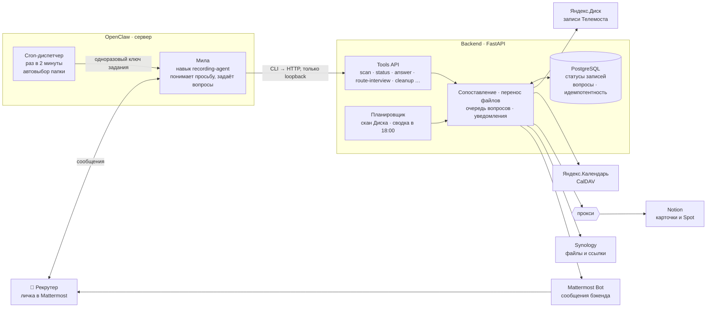
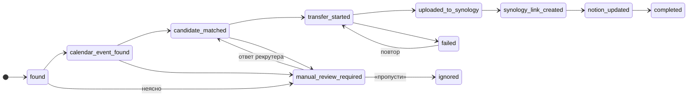

# Архитектура Recording Agent

Главная мысль: модель общается, бэкенд исполняет. У Милы нет ключей от внешних сервисов, есть только узкие команды навыка. Каждое её действие бэкенд проверяет заново.

## Схема компонентов



## Та же схема без Mermaid (для слайда или печати)

```text
 Рекрутер ◄──────────────── сообщения «готово», вопросы, сводка 18:00 ───────────┐
    │ личка                                                                     │
    ▼                                                                           │
┌──────────────────────┐   CLI → HTTP    ┌───────────────────────────────────┐   │
│ Мила · OpenClaw      │ ──────────────► │ Backend · FastAPI                 │   │
│ навык recording-agent│   (loopback)    │  • планировщик: скан, сводка      │   │
│ нет ключей сервисов  │                 │  • сопоставление записи           │   │
└──────────────────────┘                 │  • перенос файлов, ссылки         │   │
          ▲                              │  • очередь вопросов и уведомлений │   │
          │ одноразовый ключ задания     │  • все ключи сервисов — здесь     │   │
┌──────────────────────┐                 └──────┬──────────┬─────────────────┘   │
│ Cron-диспетчер       │                        │          │                     │
│ раз в 2 мин          │                 ┌──────▼──────┐   ├──► Яндекс.Диск       │
└──────────────────────┘                 │ PostgreSQL  │   ├──► Яндекс.Календарь  │
                                         │ статусы,    │   ├──► прокси ──► Notion │
                                         │ вопросы     │   ├──► Synology          │
                                         └─────────────┘   └──► Mattermost Bot ───┘
```

## Что показать на схеме словами

| Элемент | Роль | Чего у него нет |
|---|---|---|
| Мила | понимает свободный текст рекрутера, вызывает команды навыка, задаёт вопросы | ключей от Диска, Notion, Synology; доступа к путям на сервере; команд удаления |
| Cron-диспетчер | раз в две минуты спрашивает бэкенд, есть ли задание; если есть — запускает Милу в отдельной сессии | модели: пустой опрос обходится без LLM |
| Backend | делает всю работу с сервисами, хранит состояние, отправляет сообщения | собственных решений о папке: выбор папки — только из разрешённого списка |
| PostgreSQL | статус каждой записи по шагам, вопросы, защита от повторов | — |
| Прокси | единственный путь от сервера к Notion | стабильности: главный источник сбоев |

## Статусы одной записи



Каждый шаг сохраняется. После сбоя запись продолжает с последнего сохранённого шага, и файл второй раз не загружается.
